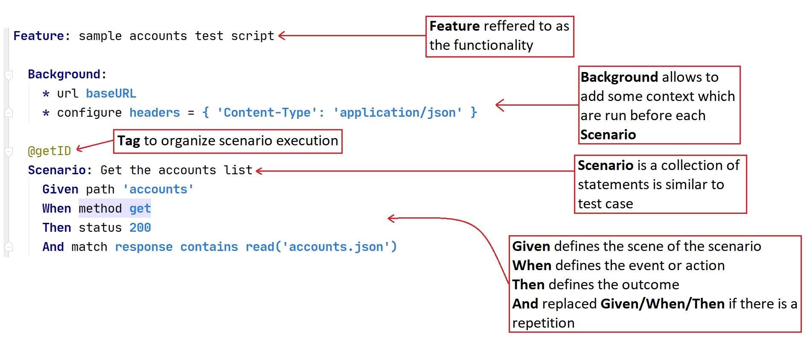
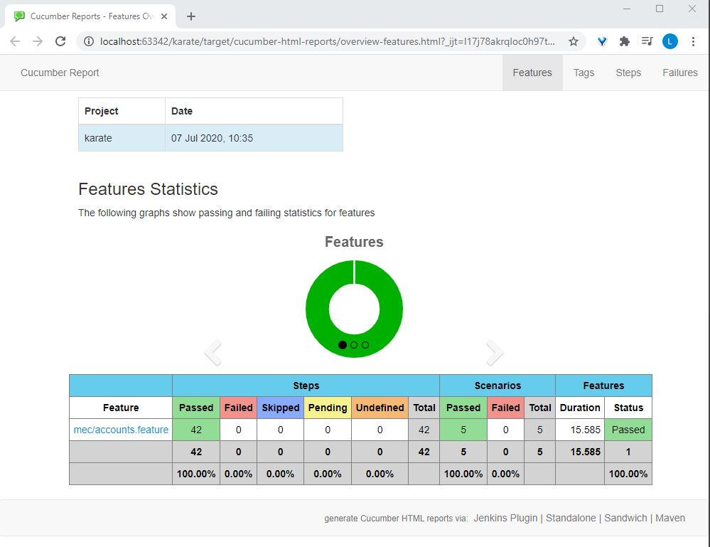
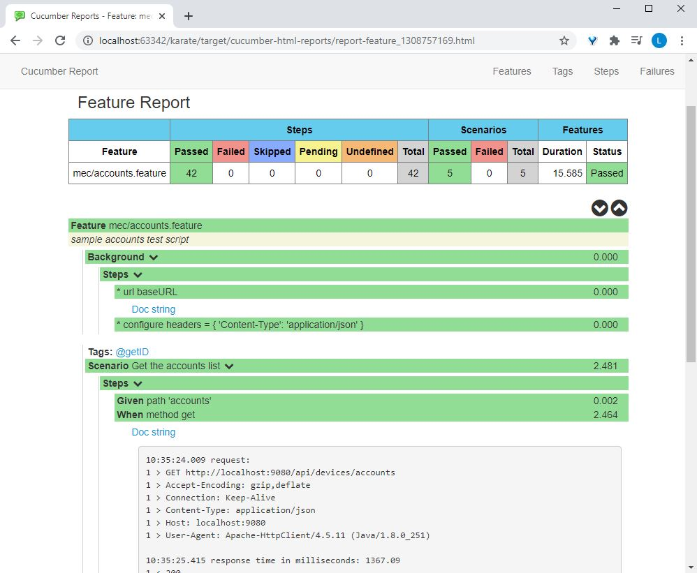

#  Karate
## Test Automation Made `Simple.`

Karate is an open-source API test automation tool. API tests are written using Behaviour Driven Development (BDD) Gherkin syntax. Unlike other BDD frameworks like Cucumber, Specflow or JBehave, Karate has all the step definitions written for us so we don’t have to worry about writing them. This enables even non-developers to easily write API tests for the services

## Sample



> If you are familiar with Cucumber / Gherkin, the [*big difference*](#cucumber-vs-karate) here is that you **don't** need to write extra "glue" code or Java "step definitions" !

It is worth pointing out that JSON is a 'first class citizen' of the syntax such that you can express payload and expected data without having to use double-quotes and without having to enclose JSON field names in quotes.  There is no need to 'escape' characters like you would have had to in Java or other programming languages.

And you don't need to create additional Java classes for any of the payloads that you need to work with.

# Index

<table>
<tr>
  <th>Start</th>
  <td>
      <a href="#maven">Maven</a> 
  </td>
</tr>
<tr>
  <th>Run</th>
  <td>
      <a href="#command-line">Command Line</a>
    | <a href="#parallel-execution">Parallel Execution</a>
  </td>
</tr>
<tr>
  <th>Report</th>
  <td>
      <a href="#configuration">Configuration</a> 
    | <a href="#test-reports">Reports</a>
  </td>
</tr>
<tr>
  <th>Types</th>
  <td>
      <a href="#json">JSON</a>
    | <a href="#reading-files">Reading Files</a>
  </td>
</tr>
<tr>
  <th>Variables</th>
  <td>
      <a href="#def"><code>def</code></a>
    | <a href="#text"><code>text</code></a>
    | <a href="#table"><code>table</code></a>
  </td>
</tr>
<tr>
  <th>Actions</th>
  <td>
      <a href="#assert"><code>assert</code></a>
    | <a href="#print"><code>print</code></a>
    | <a href="#call"><code>call</code></a> 
    | <a href="#reading-files"><code>read()</code></a>
  </td>
</tr>
<tr>
  <th>HTTP</th>
  <td>
      <a href="#url"><code>url</code></a> 
    | <a href="#path"><code>path</code></a>
    | <a href="#request"><code>request</code></a>
    | <a href="#method"><code>method</code></a>
    | <a href="#status"><code>status</code></a>
  </td>
</tr>
<tr>
  <th>Request</th>
  <td>
      <a href="#param"><code>param</code></a> 
    | <a href="#header"><code>header</code></a>    
  </td>
</tr>
<tr>
  <th>Response</th>
  <td>
      <a href="#response"><code>response</code></a>
    | <a href="#responsestatus"><code>responseStatus</code></a>
  </td>
</tr>
<tr>
  <th>Assert</th>
  <td>
      <a href="#match"><code>match ==</code></a>
    | <a href="#match-contains"><code>match contains</code></a>
    | <a href="#fuzzy-matching">Fuzzy Matching</a>
    | <a href="#schema-validation">Schema Validation</a>
  </td>
</tr>
<tr>
  <th>Re-Use</th>
  <td>
      <a href="#calling-other-feature-files">Calling Other <code>*.feature</code> Files</a>
    | <a href="#data-driven-tests">Data Driven Scenarios</a>    
  </td>
</tr>
</table>

# Features
* Java knowledge is not required and even non-programmers can write tests
* Scripts are plain-text, require no compilation step or IDE, and teams can collaborate using Git / standard SCM
* Based on the popular Cucumber / Gherkin standard - with [IDE support](https://github.com/intuit/karate/wiki/IDE-Support) and syntax-coloring options
* Scripts can [call other scripts](#calling-other-feature-files) - which means that you can easily re-use and maintain authentication and 'set up' flows efficiently, across multiple tests
* Embedded JavaScript engine that allows you to build a library of [re-usable functions](#calling-javascript-functions) that suit your specific environment or organization
* Re-use of payload-data and user-defined functions across tests is [so easy](#reading-files) - that it becomes a natural habit for the test-developer
* Support for [data-driven tests](#data-driven-tests) and being able to [tag or group](#tags) tests is built-in, no need to rely on an external framework
* Built-in [test-reports](#test-reports) compatible with Cucumber so that you have the option of using third-party (open-source) maven-plugins for even [better-looking reports](karate-demo#example-report)

## Maven
Karate is designed so that you can choose between the [Apache](https://hc.apache.org/index.html) or [Jersey](https://jersey.java.net) HTTP client implementations.

So you need two `<dependencies>`:

```xml
<dependency>
    <groupId>com.intuit.karate</groupId>
    <artifactId>karate-apache</artifactId>
    <version>0.9.5</version>
    <scope>test</scope>
</dependency>
<dependency>
    <groupId>com.intuit.karate</groupId>
    <artifactId>karate-junit5</artifactId>
    <version>0.9.5</version>
    <scope>test</scope>
</dependency>
```

## Command Line
Normally in dev mode, you will use your IDE to run a `*.feature` file directly or via the companion 'runner' JUnit Java class. When you have a 'runner' class in place, it would be possible to run it from the command-line as well.

You can choose a single test to run like this:

```
mvn test -Dtest=AccountsTest
```

When your Java test "runner" is linked to multiple feature files, which will be the case when you use the recommended [parallel runner](#parallel-execution), you can narrow down your scope to a single feature (or even directory) via the command-line, useful in dev-mode. Note how even [tags](#tags) to exclude (or include) can be specified using the [Karate options](#karate-options).

```
mvn test -Dkarate.options="--tags ~@ignore classpath:mec/accounts.feature" -Dtest=AccountsTest
```

## Parallel Execution
Karate can run tests in parallel, and dramatically cut down execution time. This is a 'core' feature and does not depend on JUnit, Maven or Gradle. 

* You can easily "choose" features and tags to run and compose test-suites in a very flexible manner.
* You can use the returned `Results` object to check if any scenarios failed, and to even summarize the errors
* [JUnit XML](https://wiki.jenkins-ci.org/display/JENKINS/JUnit+Plugin) reports will be generated in the "`reportDir`" path you specify, and you can easily configure your CI to look for these files after a build (for e.g. in `**/*.xml` or `**/surefire-reports/*.xml`)
* [Cucumber JSON reports](https://relishapp.com/cucumber/cucumber/docs/formatters/json-output-formatter) will be generated side-by-side with the JUnit XML reports and with the same name, except that the extension will be `.json` instead of `.xml`

### Parallel Execution
```java
import com.intuit.karate.Results;
import com.intuit.karate.Runner;
import static org.junit.jupiter.api.Assertions.*;
import org.junit.jupiter.api.Test;

public class AccountsTest {

    @Test
    public void testAccount() {
        Results results = Runner.path("classpath:mec/").parallel(5);
        generateReport(results.getReportDir());
        assertEquals(0, results.getFailCount(), results.getErrorMessages());
    }
}
```

* The `Runner.path()` is how you refer to the package you want to execute, and all feature files within sub-directories will be picked up
* `Runner.path()` takes multiple string parameters, so you can refer to multiple packages or even individual `*.feature` files and easily "compose" a test-suite
  * e.g. `Runner.path("classpath:mec", "classpath:mec/accounts.feature")`
* To [choose tags](#tags), call the `tags()` API, note that in the example above, any `*.feature` file tagged as `~@ignore` will be skipped - as the `~` prefix means a "NOT" operation. You can also specify tags on the [command-line](#test-suites). The `tags()` method also takes multiple arguments, for e.g.
  * this is an "AND" operation: `tags("@customer", "@smoke")`
  * and this is an "OR" operation: `tags("@customer,@smoke")`
* `parallel()` *has* to be the last method called, and you pass the number of parallel threads needed. It returns a `Results` object that has all the information you need - such as the number of passed or failed tests.

### Parallel Stats
For convenience, some stats are logged to the console when execution completes, which should look something like this:

```
======================================================
elapsed:   2.35 | threads:    5 | thread time: 4.98 
features:    54 | ignored:   25 | efficiency: 0.42
scenarios:  145 | passed:   145 | failed: 0
======================================================
```

The parallel runner will always run `Feature`-s in parallel. Karate will also run `Scenario`-s in parallel by default. So if you have a `Feature` with multiple `Scenario`-s in it - they will execute in parallel, and even each `Examples` row in a `Scenario Outline` will do so ! 

A `timeline.html` file will also be saved to the report output directory mentioned above (`target/surefire-reports` by default) - which is useful for visually verifying or troubleshooting the effectiveness of the test-run.

### `@parallel=false`
In rare cases you may want to suppress the default of `Scenario`-s executing in parallel and the special [`tag`](#tags) `@parallel=false` can be used. If you place it above the [`Feature`](#script-structure) keyword, it will apply to all `Scenario`-s. And if you just want one or two `Scenario`-s to NOT run in parallel, you can place this tag above only *those* `Scenario`-s. See [example](karate-demo/src/test/java/demo/encoding/encoding.feature).

## Test Reports
Most CI tools would be able to process the JUnit XML output of the [parallel runner](#parallel-execution) and determine the status of the build as well as generate reports.

For example, here below is an actual report generated by the [cucumber-reporting](https://github.com/damianszczepanik/cucumber-reporting) open-source library.  



This report is recommended especially because Karate's integration includes the HTTP request and response logs in-line with the test report, which is extremely useful for troubleshooting test failures.



# Configuration
> You can skip this section and jump straight to the [Syntax Guide](#syntax-guide) if you are in a hurry to get started with Karate. Things will work even if the `karate-config.js` file is not present.

## Classpath

## `karate-config.js`

The only 'rule' is that on start-up Karate expects a file called `karate-config.js` to exist on the 'classpath' and contain a JavaScript function. The function is expected to return a JSON object and all keys and values in that JSON object will be made available as script variables.

```javascript    
function fn() {
  var env = karate.env; // get java system property 'karate.env'
  karate.log('karate.env system property was:', env);
  if (!env) {
    env = 'dev'; // a custom 'intelligent' default
  }
  var port ='9080'

  var config = {
    baseURL: 'http://localhost:' + port + '/api/devices'
  };

  karate.configure('connectTimeout', 5000);
  karate.configure('readTimeout', 5000);
  return config;
}
```

# Setting and Using Variables
## `def`
### Set a named variable
```cucumber
# assigning a string value:
* def accountID = accountList[0].id

# using a variable
Then print accountID
```
Note that `def` will over-write any variable that was using the same name earlier.

## `assert`
### Assert if an expression evaluates to `true`
Once defined, you can refer to a variable by name. Expressions are evaluated using the embedded JavaScript engine. The assert keyword can be used to assert that an expression returns a boolean value.

```cucumber
Given def color = 'red '
And def num = 5
Then assert color + num == 'red 5'
```
Everything to the right of the `assert` keyword will be evaluated as a single expression.

## `print`
### Log to the console
You can use `print` to log variables to the console in the middle of a script. For convenience, you can have multiple expressions separated by commas, so this is the recommended pattern:

```cucumber
* print 'the value of a is:', a
```

Similar to [`assert`](#assert), the expressions on the right-hand-side of a `print` have to be valid JavaScript.

If you use commas (instead of concatenating strings using `+`), Karate will 'pretty-print' variables

```cucumber
* def myJson = { foo: 'bar', baz: [1, 2, 3] }
* print 'the value of myJson is:', myJson
```
Which results in the following output:
```
20:29:11.290 [main] INFO  com.intuit.karate - [print] the value of myJson is: {
  "foo": "bar",
  "baz": [
    1,
    2,
    3
  ]
}
```

# 'Native' data types
Native data types mean that you can insert them into a script without having to worry about enclosing them in strings and then having to 'escape' double-quotes all over the place. They seamlessly fit 'in-line' within your test script.

## JSON
Note that the parser is 'lenient' so that you don't have to enclose all keys in double-quotes.
```cucumber
* def cat = { name: 'Billie', scores: [2, 5] }
* assert cat.scores[1] == 5
```

> Some characters such as the hyphen `-` are not permitted in 'lenient' JSON keys (because they are interpreted by the JS engine as a 'minus sign'). In such cases, you *have* to use string quotes: `{ 'Content-Type': 'application/json' }`

When asserting for expected values in JSON or XML, always prefer using [`match`](#match) instead of [`assert`](#assert). Match failure messages are much more descriptive and useful, and you get the power of [embedded expressions](#embedded-expressions) and [fuzzy matching](#fuzzy-matching).
```cucumber
* def cats = [{ name: 'Billie' }, { name: 'Bob' }]
* match cats[1] == { name: 'Bob' }
```

Karate's native support for JSON means that you can assign parts of a JSON instance into another variable, which is useful when dealing with complex [`response`](#response) payloads.
```cucumber
* def first = cats[0]
* match first == { name: 'Billie' }
```

## `table`
### A simple way to create JSON Arrays
Now that we have seen how JSON is a 'native' data type that Karate understands, there is a very nice way to create JSON using Cucumber's support for expressing [data-tables](http://www.thinkcode.se/blog/2014/06/30/cucumber-data-tables).

```cucumber
* table devices
    | description | name  |       type      | vendorName |
    |    clock    | clock | philips_account |    Any     |
    |    fan      | fan   | jawbone_account |    Any     |
    |    bulb     | bulb  | mihome_account  |    Any     |

* match devices == [
                    { description: 'clock', name: 'clock', type: 'philips_account', vendorName: 'Any' }, 
                    { description: 'fan', name: 'fan', type: 'jawbone_account', vendorName: 'Any' }, 
                    { description: 'bulb', name: 'bulb', type: 'mihome_account', vendorName: 'Any' } 
                   ]
```
The [`match`](#match) keyword is explained later, but it should be clear right away how convenient the `table` keyword is. 

## Reading Files
Karate makes re-use of payload data, utility-functions and even other test-scripts as easy as possible. Teams typically define complicated JSON (or XML) payloads in a file and then re-use this in multiple scripts. And such re-use makes it easier to re-factor tests when needed, which is great for maintainability.

Reading files is achieved using the built-in JavaScript function called `read()`. By default, the file is expected to be in the same folder (package) and side-by-side with the `*.feature` file. But you can prefix the name with `classpath:` in which case the 'root' folder(#classpath) would be `src/test/java`.

Prefer `classpath:` when a file is expected to be heavily re-used all across your project.  And yes, relative paths will work.

```cucumber
# json
* def someJson = read('accounts.json')

# xml
* def someXml = read('../common/my-xml.xml')

# import yaml (will be converted to json)
* def jsonFromYaml = read('some-data.yaml')

# csv (will be converted to json)
* def jsonFromCsv = read('some-data.csv')

# string
* def someString = read('classpath:messages.txt')

# javascript (will be evaluated)
* def someValue = read('some-js-code.js')

# if the js file evaluates to a function, it can be re-used later using the 'call' keyword
* def someFunction = read('classpath:some-reusable-code.js')
* def someCallResult = call someFunction

# the following short-cut is also allowed
* def someCallResult = call read('some-js-code.js')
```

You can also [re-use other `*.feature`](#calling-other-feature-files) files from test-scripts:

```cucumber
# perfect for all those common authentication or 'set up' flows
* def result = call read('accounts.feature@getID')
```

And a very common need would be to use a file as the [`request`](#request) body:

```cucumber
Given request read('some-big-payload.json')
```

Or in a [`match`](#match):

```cucumber
And match response == read('expected-response-payload.json')
```

The rarely used `file:` prefix is also supported. You could use it for 'hard-coded' absolute paths in dev mode, but is obviously not recommended for CI test-suites. A good example of where you may need this is if you programmatically write a file to the `target` folder, and then you can read it like this:

```cucumber
* def payload = read('file:target/large.xml')
```

# Core Keywords
They are `url`, `path`, `request`, `method` and `status`.

These are essential HTTP operations, they focus on setting one (un-named or 'key-less') value at a time and therefore don't need an `=` sign in the syntax.

## `url`
```cucumber
Given url 'http://localhost:9080/api/devices'
```
A URL remains constant until you use the `url` keyword again, so this is a good place to set-up the 'non-changing' parts of your REST URL-s.

A URL can take expressions, so the approach below is legal.  And yes, variables can come from global [config](#configuration).
```cucumber
Given url 'http://localhost:' + port + '/api/devices'
```

## `path`
REST-style path parameters.  Can be expressions that will be evaluated.  Comma delimited values are supported which can be more convenient, and takes care of URL-encoding and appending '/' where needed.
```cucumber
Given path 'devices/' + 'accounts'

# this is equivalent to the above
Given path 'devices', 'accounts'

# or you can do the same on multiple lines if you wish
Given path 'devices'
And path 'accounts'
```
Note that the `path` 'resets' after any HTTP request is made but not the `url`.
> Important: If you attempt to build a URL in the form `?myparam=value` by using `path` the `?` will get encoded into `%3F`. Use either the [`param`](#param) keyword, e.g.: `* param myparam = 'value'` or [`url`](#url): `* url 'http://example.com/v1?myparam'`

## `request`
In-line JSON:
```cucumber
Given request { id: '5f03ed7da8cb5700404a054d', name: 'fan' }
```

From a [file](#reading-files) in the same package.  Use the `classpath:` prefix to load from the classpath instead.
```cucumber
And match response contains read('accounts.json')
```

In most cases you won't need to set the `Content-Type` [`header`](#header) as Karate will automatically do the right thing depending on the data-type of the `request`.

Defining the `request` is mandatory if you are using an HTTP `method` that expects a body such as `post`. If you really need to have an empty body, you can use an empty string as shown below, and you can force the right `Content-Type` header by using the [`header`](#header) keyword.

```cucumber
Given request ''
And header Content-Type = 'text/html'
```

## `method`
The HTTP verb - `get`, `post`, `put`, `delete`, `patch`, `options`, `head`, `connect`, `trace`.

Lower-case is fine.
```cucumber
When method post
```

It is worth internalizing that during test-execution, it is upon the `method` keyword that the actual HTTP request is issued. Which suggests that the step should be in the `When` form, for example: `When method post`. And steps that follow should logically be in the `Then` form. Also make sure that you complete the set up of things like [`url`](#url), [`param`](#param), [`header`](#header), [`configure`](#configure) etc. *before* you fire the `method`.

```cucumber
# set headers or params (if any) BEFORE the method step
Given header Accept = 'application/json'
When method get
# the step that immediately follows the above would typically be:
Then status 200
```

## `status`
This is a shortcut to assert the HTTP response code.
```cucumber
Then status 200
```
And this assertion will cause the test to fail if the HTTP response code is something else.

See also [`responseStatus`](#responsestatus) if you want to do some complex assertions against the HTTP status code.

# Keywords that set key-value pairs
They are `param`, `header`

The syntax will include a '=' sign between the key and the value.  The key should not be within quotes.

## `param` 
Setting query-string parameters:
```cucumber
Given param id = '123'
And param name = 'fan'
```

The above would result in a URL like: `http://localhost:9080/api/devices?id=123&name=fan`. Note that the `?` and `&` will be automatically inserted.

Multi-value params are also supported:
```cucumber
* param id = '123', '456'
```

You can also use JSON to set multiple query-parameters in one-line using [`params`](#params) and this is especially useful for dynamic data-driven testing.

## `header`

You can use functions or expressions
```cucumber
Given header Authorization = myAuthFunction()
And header transaction-id = 'test-' + myIdString
```

It is worth repeating that in most cases you won't need to set the `Content-Type` header as Karate will automatically do the right thing depending on the data-type of the [`request`](#request).

A common need is to send the same header(s) for _every_ request, and configure headers (with JSON) is how you can set this up once for all subsequent requests. And if you do this within a `Background:` section, it would apply to all `Scenario:` sections within the `*.feature` file.

```cucumber
* configure headers = { 'Content-Type': 'application/json' }
```

# Payload Assertions
## Prepare, Mutate, Assert.
Now it should be clear how Karate makes it easy to express JSON or XML. If you [read from a file](#reading-files), the advantage is that multiple scripts can re-use the same data.

Once you have a [JSON or XML object](#native-data-types), Karate provides multiple ways to manipulate, extract or transform data. And you can easily assert that the data is as expected by comparing it with another JSON or XML object.

## `match`
### Payload Assertions / Smart Comparison
The `match` operation is smart because white-space does not matter, and the order of keys (or data elements) does not matter. Karate is even able to [ignore fields you choose](#ignore-or-validate) - which is very useful when you want to handle server-side dynamically generated fields such as UUID-s, time-stamps, security-tokens and the like.

The match syntax involves a double-equals sign '==' to represent a comparison (and not an assignment '=').

### `match` and variables
In case you were wondering, variables (and even expressions) are supported on the right-hand-side. So you can compare 2 JSON (or XML) payloads if you wanted to:
```cucumber
* match response == { id: '5f03ed7da8cb5700404a054d', name: 'fan' }
```

## Fuzzy Matching
### Ignore or Validate
When expressing expected results (in JSON or XML) you can mark some fields to be ignored when the match (comparison) is performed. This means that even when you have dynamic server-side generated values such as UUID-s and time-stamps appearing in the response, you can still assert that the full-payload matched in one step.

```cucumber
match response == {
  "id": "#string",
  "name": "#string",
  "vendorName": "#string",
  "type": "#string",
  "subtype": "##null #string",
  "description": "##null #string",
  "isAuthorized": "#boolean",
  "actions": "#array"
}	
```

The supported markers are the following:

Marker | Description
------ | -----------
`#ignore` | Skip comparison for this field even if the data element or JSON key is present
`#null` | Expects actual value to be `null`, and the data element or JSON key *must* be present
`#notnull` | Expects actual value to be not-`null`
`#present` | Actual value can be any type or *even* `null`, but the key *must* be present (only for JSON / XML, see below)
`#notpresent` | Expects the key to be **not** present at all (only for JSON / XML, see below)
`#array` | Expects actual value to be a JSON array
`#object` | Expects actual value to be a JSON object
`#boolean` | Expects actual value to be a boolean `true` or `false`
`#number` | Expects actual value to be a number
`#string` | Expects actual value to be a string
`#uuid` | Expects actual (string) value to conform to the UUID format
`#regex STR` | Expects actual (string) value to match the regular-expression 'STR' (see examples above)
`#? EXPR` | Expects the JavaScript expression 'EXPR' to evaluate to true, see [self-validation expressions](#self-validation-expressions) below
`#[NUM] EXPR` | Advanced array validation, see [schema validation](#schema-validation)
`#(EXPR)` | For completeness, [embedded expressions](#embedded-expressions) belong in this list as well

## Matching Sub-Sets of JSON Keys and Arrays
### `match contains`
#### JSON Keys
In some cases where the response JSON is wildly dynamic, you may want to only check for the existence of some keys. And `match` (name) `contains` is how you can do so:

```cucumber
* match response contains {
  "id": "#string",
  "name": "#string",
  "vendorName": "#string",
  "type": "#string",
  "subtype": "##null #string",
  "description": "##null #string",
  "isAuthorized": "#boolean",
  "actions": "#array"
}	
```

Note that `match contains` will "recurse", so any nested JSON chunks will also be matched using `match contains`:

## Schema Validation
Karate provides a far more simpler and more powerful way than [JSON-schema](http://json-schema.org) to validate the structure of a given payload. You can even mix domain and conditional validations and perform all assertions in a single step.

But first, a special short-cut for array validation needs to be introduced:

```cucumber
* def foo = ['bar', 'baz']

# should be an array
* match foo == '#[]'

# should be an array of size 2
* match foo == '#[2]'

# should be an array of strings with size 2
* match foo == '#[2] #string'

# each array element should have a 'length' property with value 3
* match foo == '#[]? _.length == 3'

# should be an array of strings each of length 3
* match foo == '#[] #string? _.length == 3'

# should be null or an array of strings
* match foo == '##[] #string'
```

# Special Variables
These are 'built-in' variables, there are only a few and all of them give you access to the HTTP response.

## `response`
After every HTTP call this variable is set with the response body, and is available until the next HTTP request over-writes it. You can easily assign the whole `response` (or just parts of it using Json-Path or XPath) to a variable, and use it in later steps.

The response is automatically available as a JSON, XML or String object depending on what the response contents are.

As a short-cut, when running JsonPath expressions - `$` represents the `response`.  This has the advantage that you can use pure [JsonPath](https://github.com/jayway/JsonPath#path-examples) and be more concise.  For example:

```cucumber
# the three lines below are equivalent
Then match response == { id: '123', name: 'fan' }
```

## `responseStatus`
You would normally only need to use the [`status`](#status) keyword.  But if you really need to use the HTTP response code in an expression or save it for later, you can get it as an integer:

```cucumber
* def uploadStatusCode = responseStatus

# check if the response status is either of two values
Then assert responseStatus == 200 || responseStatus == 204
```

# Code Reuse / Common Routines
## `call`
In any complex testing endeavor, you would find yourself needing 'common' code that needs to be re-used across multiple test scripts. A typical need would be to perform a 'sign in', or create a fresh user as a pre-requisite for the scenarios being tested.

There are two types of code that can be `call`-ed. `*.feature` files and JavaScript functions.

## Calling other `*.feature` files
When you have a sequence of HTTP calls that need to be repeated for multiple test scripts, Karate allows you to treat a `*.feature` file as a re-usable unit. You can also pass parameters into the `*.feature` file being called, and extract variables out of the invocation result.

Here is an example of using the `call` keyword to invoke another feature file, loaded using the [`read`](#reading-files) function:

```cucumber
  Scenario: Delete an account
    * def result = call read('accounts.feature@getID')
    * def accountList = result.response
    * def accountID = accountList[0].id

    Given path accountID
    When method delete
    Then status 200
```

> Note that [`def`](#def) can be used to *assign* a __feature__ to a variable. 

### Call Tag Selector
You can "select" a single `Scenario` (or `Scenario`-s or `Scenario Outline`-s or even specific `Examples` rows) by appending a "tag selector" at the end of the feature-file you are calling. For example:

```cucumber
call read('accounts.feature@getID')
```

While the tag does not need to be in the `@key=value` form, it is recommended for readability when you start getting into the business of giving meaningful names to your `Scenario`-s.

## Data Driven Tests
### The Cucumber Way
Cucumber has a concept of [Scenario Outlines](https://docs.cucumber.io/gherkin/reference/#scenario-outline) where you can re-use a set of data-driven steps and assertions, and the data can be declared in a very user-friendly fashion. Observe the usage of `Scenario Outline:` instead of `Scenario:`, and the new `Examples:` section.

You should take a minute to compare this with the [exact same example implemented in REST-assured and TestNG](https://github.com/basdijkstra/rest-assured-workshop/blob/d9734da98bfcd8087055bdcd78545581dd23cb77/src/test/java/answers/RestAssuredAnswers2Test.java). Note that this example only does a "string equals" check on *parts* of the JSON, but with Karate you are always encouraged to match the *entire* payload in one step.

```cucumber
Feature: sample accounts test script

  Background:
    * url baseURL
    * configure headers = { 'Content-Type': 'application/json' }

  Scenario Outline: Add an account
    * def body = { description: '<description>', name: '<name>', type: '<type>', vendorName: '<vendorName>' }

    Given path 'accounts'
    And request body
    When method post
    Then status 201

    Examples:
    | description | name  |       type      | vendorName |
    |    clock    | clock | philips_account |    Any     |
    |    fan      | fan   | jawbone_account |    Any     |
    |    bulb     | bulb  | mihome_account  |    Any     |
```
This is great for testing boundary conditions against a single end-point, with the added bonus that your test becomes even more readable. This approach can certainly enable product-owners or domain-experts who are not programmer-folk, to review, and even collaborate on test-scenarios and scripts.

### The Karate Way
The limitation of the Cucumber `Scenario Outline:` (seen above) is that the number of rows in the `Examples:` is fixed. Karate can loop over a *.feature file for each object in a JSON array - which gives you dynamic data-driven testing, if you need it.

Also see the option below, where you can data-drive an `Examples:` table using JSON.

### Dynamic Scenario Outline
You can feed an `Examples` table from a JSON array, which is great for those situations where the table-content is dynamically resolved at run-time. This capability is triggered when the table consists of a single "cell", i.e. there is exactly one row and one column in the table.  Here is an example (also see [this video](https://twitter.com/KarateDSL/status/1051433711814627329)):

```cucumber
  Scenario Outline: Add an account
    * def body = { description: '<description>', name: '<name>', type: '<type>', vendorName: '<vendorName>' }

    Given path 'accounts'
    And request body
    When method post
    Then status 201
~~~~
    Examples:
      |read('data.csv')|
```
